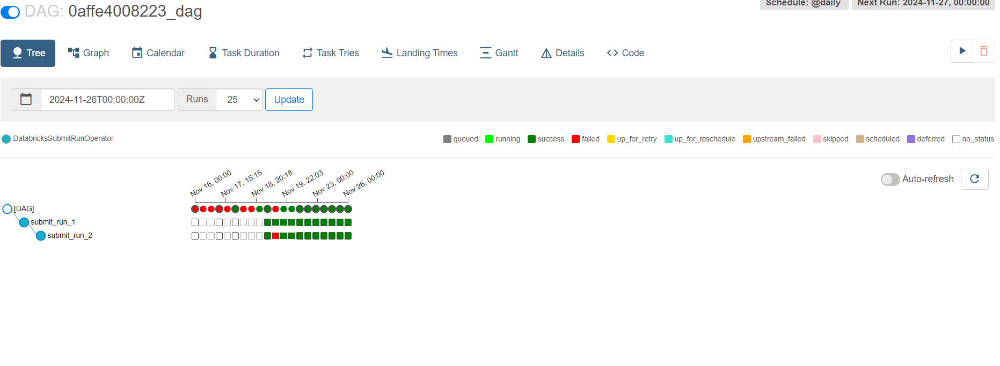

# Project description

Pinterest, a popular social media platform and visual discovery engine, allows users to save and share ideas through images and videos known as "pins." Users organise their pins into themed collections called "boards," covering diverse topics like home decor, fashion, recipes, and more. With vast data storage and processing billions of data points daily, Pinterest aims to enhance user experience by leveraging data insights.

This project aims to replicate Pinterest's data processing system by creating an end-to-end pipeline on the AWS Cloud. The pipeline orchestrates data ingestion, storage, and real-time analysis, utilising a range of technologies:

Amazon Elastic Compute Cloud (EC2) for computing resources
Amazon Simple Storage Service (S3) for scalable object storage
SQL for data querying and manipulation
Apache Kafka/AWS Managed Streaming for Apache Kafka (MSK) for streaming data processing
Amazon API Gateway for creating APIs
Spark for distributed data processing
Databricks for data engineering and analytics
Amazon Managed Workflows for Apache Airflow (MWAA) for workflow orchestration
Amazon Kinesis for real-time data streaming
By leveraging these technologies, this project aims to demonstrate how to build a secure, robust and scalable data processing pipeline similar to that of Pinterest via AWS Cloud. Additionally, the pipeline facilitates value extraction through SQL queries, enhancing the project's analytical capabilities.

# Usage instructions

1. Data emulation
    - Milestone 1 and 2

2. Batch processing
    - Milestone 3 to 8

3. Stream Processing
    - Milestone 9

4. Data Querying 
    - Milestone 7

# Installation instructions
## Milestone 1: Set up the environment
From the main/root directory of the project folder, follow these steps. Clone the repository:

1. cd into the directory and then in the command line:
    ```bash
    git clone https://github.com/Fola-sade/pinterest-data-pipeline416.git
    ```
2. Set up a virtual environment for the project:
    ```bash
    conda create --name pintenv
    ```
    ```bash
    conda activate pintenv
    ```
3. Create and set up AWS and Databricks accounts. This project uses different services running in the AWS Cloud and thus an AWS Cloud Account is required. 
4. Save your database credentials to `db_creds.yaml` for security and to enable data extraction/uploads from/to various sources. 

## Milestone 2: Creating Pinterest infrastructure via AWS RDS database

The Pinterest infrastructure is replicated to resemble the environment of a data engineer at Pinterest. 

In the `user_posting_emulation_basic.py` script contains the RDS database login credentials. The RDS database comprises three tables (pinterest_data, geolocation_data, and user_data) mimicking data obtained from user POST requests to Pinterest:

- `pinterest_data`: Information about posts updated to Pinterest.
- `geolocation_data`: Geographic data corresponding to posts in `pinterest_data`.
- `user_data`: User information linked to posts in `pinterest_data`.

A `db_creds.yaml` file is created to store database credentials securely and excluded from version control using .gitignore.

The script continuously executes, emulating user posting behavior by connecting to the RDS database via SQLAlchemy. It fetches random rows from each table (pin_result, geo_result, and user_result), simulating user activity. The key-value pairing in the dictionaries are noted for later analysis.

Next, log into the AWS console keeping safe your credentials:

- AWS Account ID: <your_AWSId>
- IAM user name: <your_UserId>
- Password: <your_Password>
- The above are values to be replaced by your own and where ever mentioned herein

When using any of the AWS services, make sure to work in `us-east-1` region throughout the project.

## Milestone 3: Batch processing - Configuring the EC2 Kafka client

Install `Kafka` and the `IAM MSK authentication package` on the client `EC2` machine.
Retrieve and note the `IAM role ARN` (<your_UserId>-ec2-access-role) for cluster authentication.
Configure `Kafka` client for `IAM authentication`. Modify the `client.properties` file in the `Kafka` installation directory to enable `AWS IAM authentication`.
Create `Kafka` topics by retrieving the `Bootstrap servers` string and the Plaintext `Apache Zookeeper` connection string from the `MSK` Management Console.
Create three topics: 
- `<your_UserId>.pin` for Pinterest posts data, 
- `<your_UserId>.geo` for post geolocation data, and 
- `<your_UserId>.user` for post user data.

Check here for more detail - [Milestone 3 Outline](Milestone_3.md)

## Milestone 4: Batch Processing - Connect a MSK cluster to a S3 bucket

For this project it was not required to create a S3 bucket, an IAM role that allows you to write to this bucket or a VPC Endpoint to S3, as these had already been configured for the AWS account.

In this milestone, MSK Connect is utilised to establish a connection between the MSK cluster and an S3 bucket, enabling automatic data storage for all cluster data.

A custom plugin is created with `MSK Connect`.
Navigate to the `S3` console and locate the bucket associated with your <your_UserId> (`user-<your_UserId>-bucket`).
Download the `Confluent.io Amazon S3 Connector` on your `EC2` client and transfer it to the identified `S3` bucket.
Create a custom plugin named `<your_UserId>-plugin` in the `MSK Connect` console.
Create a connector with `MSK Connect` named `<your_UserId>-connector` in the `MSK Connect` console.
Configure the connector with the correct bucket name (`user-<your_UserId>-bucket`) and ensure the `topics.regex` field follows the format `<your_UserId>.*`.
Assign the `IAM role` used for authentication to the MSK cluster (`<your_UserId>-ec2-access-role`) in the Access permissions tab.
Upon completing these tasks, data passing through the `IAM authenticated` cluster will be automatically stored in the designated `S3` bucket.

Check here for more detail - [Milestone 4 Outline](Milestone_4.md)

## Milestone 5: Batch Processing - Configuring an API in API Gateway

This milestone focuses on building an API to replicate Pinterest's experimental data pipeline. The API will send data to the MSK cluster, which will then be stored in an S3 bucket using the previously configured connector.

A Kafka REST proxy integration method is built for the API. A resource is created for the API to enable a PROXY integration.
A HTTP ANY method is set up for the resource, ensuring the Endpoint URL reflects the correct PublicDNS of the EC2 machine associated with <your_UserId>.
The API is deployed and the Invoke URL noted for future reference.

The Kafka REST proxy is set up on the EC2 client by installing the Confluent package for the Kafka REST proxy on the EC2 client machine.
The kafka-rest.properties file is configured to allow the REST proxy to perform IAM authentication to the MSK cluster.
The REST proxy on the EC2 client machine is started.
Then send data to the API after modifying the `user_posting_emulation_basic.py` script to `user_posting_emulation_batch.py` and send data to the Kafka topics via the `API Invoke URL`.
Confirm data storage in the `S3` bucket, observing the folder organisation created by the `connector`.

Check here for more detail - [Milestone 5 Outline](Milestone_5.md)

- ### Milestone 6: Batch Processing - Databricks
This milestone focuses on setting up a `Databricks` account and learning to read data from `AWS` into `Databricks`.

Set up your own `Databricks` account followed by mounting the previously created `S3` bucket to `Databricks`.
Mount the desired S3 bucket to the Databricks account to access the batch data.
The `Databricks` account has full access to `S3`, eliminating the need to create a new `Access Key` and `Secret Access Key`.
Read data from the `Delta table` located at `dbfs:/user/hive/warehouse/authentication_credentials`.
Ensure complete paths to `JSON` objects when reading from `S3` (e.g. topics/<your_UserId>.pin/partition=0/).
Create three DataFrames: 

- `df_pin` for Pinterest post data
- `df_geo` for geolocation data
- `df_user` for user data

This summary outlines the tasks involved in configuring `Databricks`, mounting an `S3` bucket and reading data.

- ### Milestone 7: Batch processing - Spark on Databricks

Perform data cleaning and computations using Spark on Databricks. Apply this to all 3 PySpark DataFrames:

- `df_pin` for Pinterest post data
- `df_geo` for geolocation data
- `df_user` for user data

It was also demonstrated how valuable insights could be produced by joining the 3 dataframes via the execution of SQL queries (Queries.py)

- ### **Outcomes from Milestone 8 (Batch processing: AWS MWAA)**

Databricks Workloads are orchestrated on `AWS MWAA` (Managed Workflows for Apache Airflow).

Create and upload a `DAG` to a `AWS MWAA` environment. Access to a `MWAA` environment `Databricks-Airflow-env` and to its `S3` bucket `mwaa-dags-bucket` had been provided. 

An `Airflow DAG `was created that triggers two Databricks Notebooks(Queries.py and Data Clining the dataframes.py) to be run on a specific schedule. This `DAG` was uploaded to the dags folder in the `mwaa-dags-bucket` with the following naming, `<your_UserId>_dag.py`.

Manually trigger the DAG and verify its successful execution.

Here's a sample run - 

For further details follow - [Milestone 8 Outline](Milestone_8.md)

## Stream Processing:

- ### **Outcomes from Milestone 9 (Stream Processing: AWS Kinesis)**

Finally for streaming data, data is sent to Kinesis and read into Databricks.

Kinesis Data Streams is used to create three streams for the Pinterest data: 

- streaming-<your_UserId>-pin
- streaming-<your_UserId>-geo  
- streaming-<your_UserId>-user

An API is reconfigured with Kinesis Proxy Integration. This requires the creation of a new script, [user_posting_emulation_streaming.py](user_posting_emulation_streaming.py); that sends data from Pinterest tables to corresponding `Kinesis streams` via `API requests`.

Databricks ([streaming_data_processing to Kinesis](Streaming_data_processing.py)) then cleans the ingests streamed data from Kenisis and writes it into delta tables.

For further details follow - [Milestone 9 Outline](Milestone_9.md)

